# API TESTING WITH JEST
In this tutorial, we are going to create a simple CRUD API where users can create, read, update, and delete posts. We will be using <code>mongodb</code> to store our data, <code>expressjs</code> for our server, <code>Github</code> for version control, <code>JEST</code> for testing, and <code>Circle CI</code> for CDCI.
The tutorial is broken into the following sections:
1. Prerequisites
2. Creating the API
3. Setting Up Circle CI and Github
4. Create test with JEST
5. Circle CI test Validation
## 1. Prerequisites
### Basic Requirements
*In this section we will install <code>node, npm, mongodb,</code> and <code>git</code>*

Ensure that you have <code>node</code> and <code>npm</code> installed in your system. You can confirm this by running the below command in your terminal
```shell
kave@kave:$ node --version
```

You should see output similar to:
```
v14.17.6
```
For $npm$

```shell
kave@kave:$ npm --version
```

output

```
7.23.0
```
You also need to have <code>mongodb</code>. If you prefer local installation, you can download and install the correct version for your operating system. You can ensure that it is configured correctly by running on the terminal the command

```shell
kave@kave:$ mongo --version
```

where the output should be similar to:

```shell
MongoDB shell version v5.0.2
Build Info: {
    "version": "5.0.2",
    "gitVersion": "6d9ec525e78465dcecadcff99cce953d380fedc8",
    "openSSLVersion": "OpenSSL 1.1.1j  16 Feb 2021",
    "modules": [],
    "allocator": "tcmalloc",
    "environment": {
        "distmod": "ubuntu2004",
        "distarch": "x86_64",
        "target_arch": "x86_64"
    }
}

```
For git:
```shell
kave@kave:$ git --version
```
Output

```
git version 2.30.2
```

If you lack any of the above softwares you can download for your specific operating system from:

[git](https://git-scm.com/downloads)

[mongodb](https://www.mongodb.com/try/download/community)

[node](https://nodejs.org/en/download/)

and follow the installation instruction related to your system.
### Project Creation

*In this section, we create the project directory and install the required dependancies*

Having completed the above, its time to create our project. We begin by creating a directory that will host our project:

```shell
kave@kave:$ mkdir myapi && cd myapi
```

Next, we initialize a git repository

```shell
kave@kave:$ git init
```

Create a basic <code>package.json</code> 

```shell
kave@kave:$ npm init -y
```

Add dependancies:

```shell
kave@kave:$ npm install express dotenv cors
```

These packages are essential to ensure our application run smoothly:

**express:** This package will enable use serve our application

**dotenv:** This package enables us to store sensitive information as passwords, and important credentials that we may prefer not to checkout version control.

Add development dependancies:

```shell
kave@kave:$ npm install --save-dev nodemon
```

These packages are not essential in running our application but useful in the development process:

**nodemon:** This package automatically detects changes in our application and restarts the server freeing us the task of manually doing so ourselves.
Having successfully downloaded the nessesary package, its time to start coding. First, we create <code>.env</code> file to hold sensitive environmental variables and also a <code>.gitignore</code> file to ignore files that we do not want to checkout to version control.

```shell
#myapi
kave@kave:$ touch .env && touch .gitignore
```

Inside the <code>.gitignore</code> file, add

```
#myapi/.env
node_modules/
.env
```
## 2. Creating the API
*In this section we are going to create the api based on the endpoints*

In order to create the API were are going to follow the following steps:

i.    Determine the endpoints

ii. Create the database connection

iii. Create the database Schema

iv.  Create routes

v.  Create the App

vi. Create Server

Vii. Testing EndPoints Using Postman

Before beginning, we first need to install the following packages:
```shell
kave@kave:$ npm install mongoose cors
```
**cors :** This module allows for Cross Origin Resource Sharing
**mongoose** module is needed for accessing mongodb. It enables us to define a schema. A schema simply defines the structure of documents inside a MongoDB collection.

### i. Determining the endpoints
Since we are creating a simple blog API, a user should be able to perform the following actions:
1. Create posts
2. Read posts
3. Update posts
4. Delete posts

**Note**, for brevity, we are going to ignore authentication.

Having the user actions in mind, we can now go ahead and create the endpoints


| Methods | URL              | Actions                   |
|---------|------------------|---------------------------|
| GET     | api/v1/all_posts | get all posts in the blog |
| GET     | api/v1/post/:id  | get a post by id          |
| POST    | api/v1/add_post  | add a new post            |
| PUT     | api/v1/post/:id  | update a post by id       |
| DELETE  | api/v1/post/:id  | delete a post by id       |

Here we have five end points. 
> The urls take <code>api/v1/*</code> strategy. The **<code>v1</code>** is versioning of the API. Versioning is important as it enables users continue to use the previous version of the API while the migrate to the new API. In our case we may need to add functionality as authentication. In that case, our new API will take the fomart <code>api/v2/*</code>

### ii. Create the database connection
The next process is to create a database connection

```
#.env
PORT = 3000
BASE_URL = http://localhost:3000/

NODE_ENV =development
MONGODB_DEV_URL = mongodb://127.0.0.1/blog
```

```javascript
//src/databases/blog.js
const mongoose = require("mongoose");
require("dotenv").config();

//Setting up database connection
const mongodb = process.env.MONGODB_DEV_URL;
mongoose.connect(mongodb, {
  useNewUrlParser: true,
  useUnifiedTopology: true,
});
//Create a connection
const conn = mongoose.connection;

conn.on("connected", () => {
  console.log("Mongodb successfully connected");
});

conn.on("disconnected", function () {
  console.log("Mongodb disconnection successfull");
});

//handle database connection errors
conn.on("error", console.error.bind(console, "connection error:"));

```

### iii. Create the Database Schema
A schema simply defines the structure of the database. In the case of relational databases as <code>mysql</code> it would be the tables, type of data in the tables, relationship among others. Since we are using a <code>NoSql</code> database, they have no schema.  The <code>moongose</code> module enables us to create one.

Since we are dealing with a blog, a blog requires a title, content, date created and date updated. The title and content should be strings while date created and date updated are date objects. This functionality is implemented as below:

```javascript
//src/models/blogModel.js
let mongoose = require("mongoose");
const { Schema } = mongoose;

//create a schema for the blog
const blogschema = new Schema(
  {
    title: {
      type: String,
      required: [true, "You must provide a title"],
      min: 3,
      max: 50blogshema
    },
    content: {
      type: String,
      required: [true, "You must provide the content"],
    },
  },
  { timestamps: true }
);
const BlogModel = mongoose.model("Blog", blogschema);
module.exports = BlogModel;
```
**Note:-** <code>_id, created_at</code>and <code>updated_at</code> fields are autogenerated as you save your data

### iv. Create Route
We need to create the routes to our endpoints

```javascript
// src/routes/blogRouter.js
let blog = require("../models/blogModel");
const router = require("express").Router();

//Get all posts
router.get("/all_posts", async (req, res) => {
  const blogs = await blog.find();

  try {
    res.send(blogs);
  } catch (err) {
    res.status(500).send(err);
  }
});
// Add a new post entry
router.post("/add_post", async (req, res) => {
  const title = req.body.title;
  const content = req.body.content;
  const newBlog = new blog({ title, content });
  try {
    await newBlog.save();
    res.json(newBlog);
  } catch (err) {
    res.status(500).json(err.message);
  }
});
//Get one post entry
router.get("/post/:id", async (req, res) => {
  try {
    await blog.findById(req.params.id).then((myblog) => {
      res.status(200).json(myblog);
    });
  } catch (err) {
    res.status(400).json(err);
  }
});
//Update a post entry
router.put("/update/:id", async (req, res) => {
  const updates = req.body;
  try {
    await blog
      .findOneAndUpdate({ _id: req.params.id }, updates, { new: true })
      .then((myblog) => {
        res.status(200).json(myblog);
      });
  } catch (err) {
    res.status(400).json(err);
  }
});
//Delete a post entry
router.delete("/delete/:id", async (req, res) => {
  try {
    await blog
      .findByIdAndDelete(req.params.id)
      .then(() => res.status(200).json("Deletion successful"));
  } catch (err) {
    res.status(400).json("Error" + err);
  }
});

module.exports = router;

```

### v. Create App

```javascript
//src/app.js
require("dotenv").config();
const blogRouter = require("./routes/blogRouter");
require("./databases/blog");
require("./models/blogModel");

const cors = require("cors");
const express = require("express");

const app = express();
const corsOptions = {
  origin: process.env.BASE_URL,
};


//Use CORS middleware
app.use(cors());

//To parse request content-type - application/x-www-form-urlencoded
app.use(express.urlencoded({ extended: true }));

//To parse request of content-type - application/json
app.use(express.json());

//use blog router
app.use("/api/v1/", blogRouter);

module.exports = app;
```
### vi. Create Server

```javascript
//src/server.js
require("dotenv").config();
const app = require("./app");

// Port for listening for requests
const PORT = process.env.PORT || 8080;
app.listen(PORT, () => {
    console.log(`Server running on port ${PORT}`);
});

module.exports = app;

```

Before testing if our application is working,we need to first add an additional entry to the <code>package.json</code> file. Replace your <code>scripts</code> entry with the below code. As mentioned before, we will be running the server using the <code>nodemon</code> module

```json
"scripts": {
    "start": "nodemon ./src/server.js"
  },
```

You also need to make sure that you <code>mongodb</code> instance is running. For those using UNIX system as linux and mac os run the following command in terminal

```shell
kave@kave:$ sudo service mongod start
```

**NOTE:** In case there is an error try
```shell
kave@kave:$ sudo chown -R mongodb:mongodb /var/lib/mongodb
```

```shell
kave@kave:$ sudo chown mongodb:mongodb /tmp/mongodb-27017.sock
```

```shell
kave@kave:$ sudo service mongod start
```
Finally, we are ready to start our application by running 
```shell
kave@kave:$ npm start
```

If all goes well, your terminal will display the message:
```shell
[nodemon] 2.0.12
[nodemon] to restart at any time, enter `rs`
[nodemon] watching path(s): *.*
[nodemon] watching extensions: js,mjs,json
[nodemon] starting `node ./src/server.js`
Server running on port 3000
Mongodb successfully connected
```
### vii. Testing Endpoints using Postman
Since our server is running, we are now ready to test the endpoint using Postman. Postman is a testing tool for api's and quite popular. You first need to install it in your operating system if you don't have it. Their website will provide details on how to accomplish that:

[Postman](https://www.postman.com/downloads/)

Next, create a workspace and a collection. The collection we will name it <code>myApi</code>

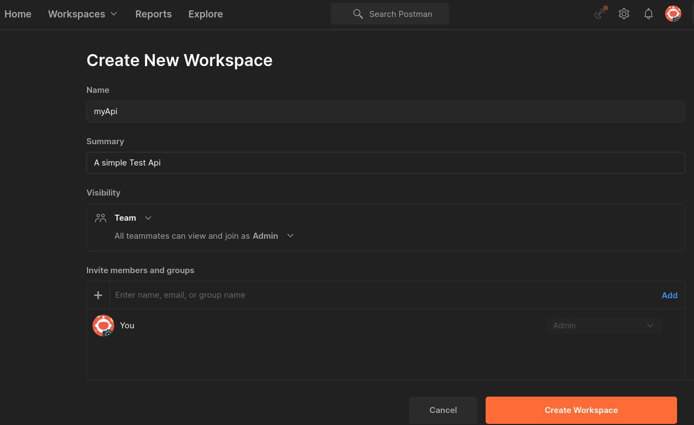

Right click on the <code>myApi</code> folder and click <code>add request</code>. Name the new request <code>Create new post </code>. Change the method to <code>POST</code> and set the url to <code>http://127.0.0.1:3000/api/v1/add_post</code>. Click on <code>Body</code> as we will be sending data. On the left drop down choose <code>raw</code> and <code>json</code>. Write the contents as shown below:
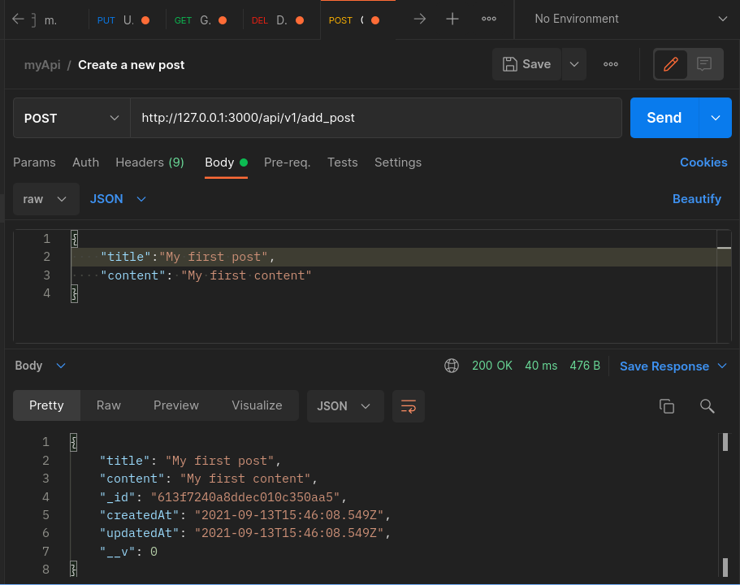.

Click the send button. You should see a response with a status 200 similar to:

```json
{
    "title": "My first post",
    "content": "My first content",
    "_id": "613f7240a8ddec010c350aa5",
    "createdAt": "2021-09-13T15:46:08.549Z",
    "updatedAt": "2021-09-13T15:46:08.549Z",
    "__v": 0
}
```
we can try to check if the data was stored in the database by navigating to the root url. Now create another request with with the name 'Get all posts' and method <code>GET</code> and change the url to <code>http://127.0.0.1:3000/api/v1/all_posts</code>. You should be able to get the one post you previously created.

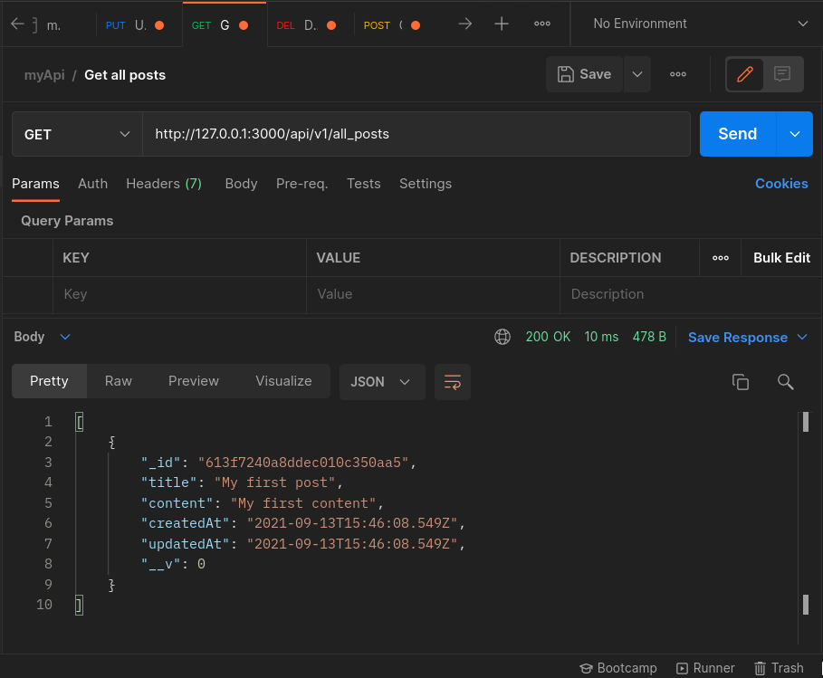

We can test we can update our posts. Create a new request with the name 'Update a post' with the method <code>PUT</code>. In order to update a post we need to know the post's <code>_id</code>. We copy the <code>_id</code> our response, in this case <code>613f7240a8ddec010c350aa5</code>. Now the update uri would be <code>http://127.0.0.1:3000/api/v1/update/613f7240a8ddec010c350aa5</code>. Notice the <code>_id</code> remain the same when you update

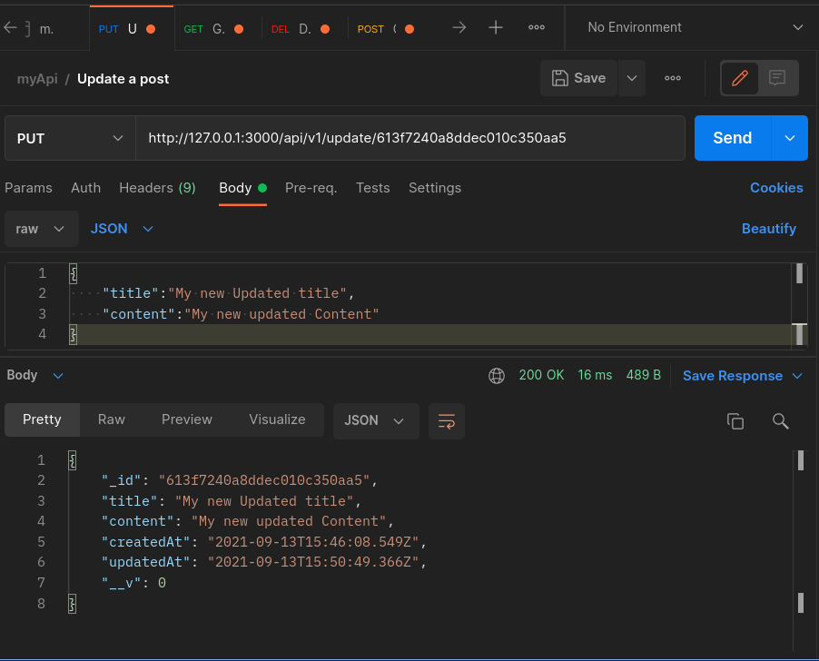

The process of deleting a post is similar as that of updating one as they both use <code>_id</code> as parameter. Here, the url is <code>http://127.0.0.1:3000/api/v1/update/613f7240a8ddec010c350aa5</code> and the method is <code>DELETE</code>.

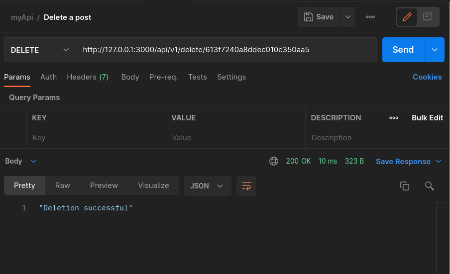

You can confirm if the item was deleted by running the request <code>Get all posts </code> from Postman

## 3. Setting Up Circle CI and Github
#### Github Intergration
At this point we are ready to make our first commit and push it to github.
From you terminal

```shell
#myapi
kave@kave:$ git add . && git commit -m "myApi first commit"
```
Next, we need to push our changes to github. To do so, you are required to firt have a github account.

[Github sign up](https://github.com/join)

Fill in your details in the page

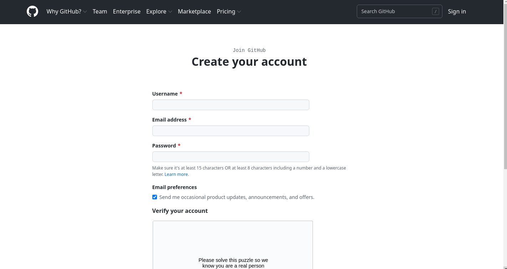

After that you need to sign in to your github account and create a new repository and fill up the required fields

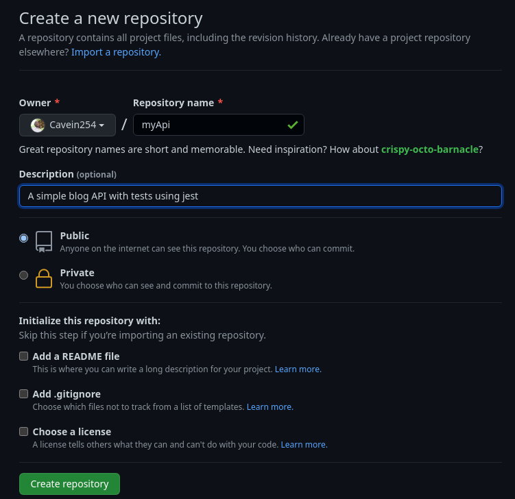

After clicking <code>create repository</code>

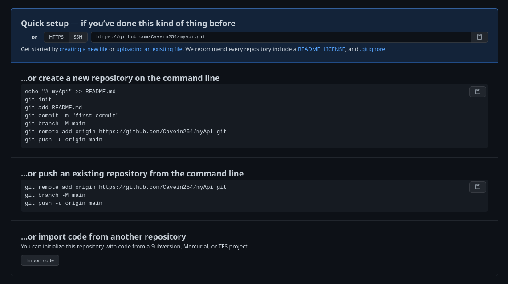


```shell
#myapi
kave@kave:$ git branch -M main
```

```shell
#myapi
kave@kave:$ git remote add origin [Add you github url here]
```

```shell
#myapi
kave@kave:$ git push -u origin main
```

If successful when you reload your browser you should see:
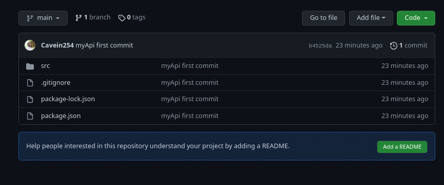
#### Circle CI intergration
The next process is to intergrate our github account with Circle CI. Go to <code>https://circleci.com/signup/</code> and select your mode of signup. In our case we choose github as we have just created our repository there. 

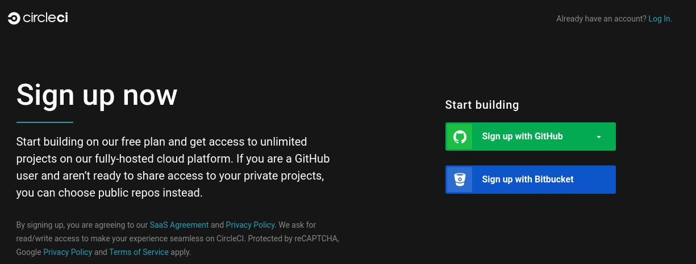

click on authorize

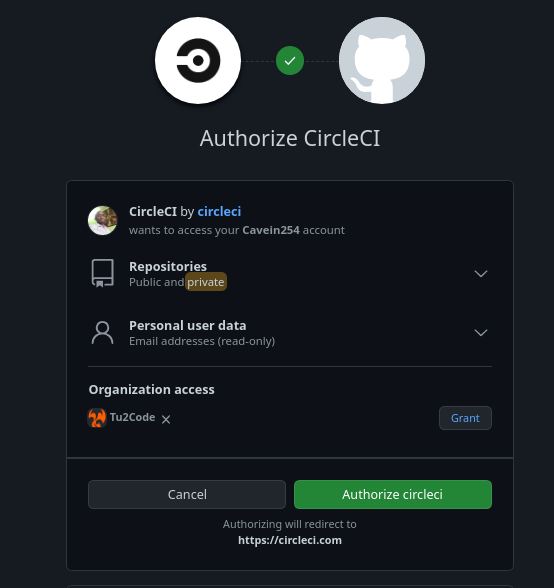

Follow the prompts, you will arrive at a landing page with your recent repository at the top

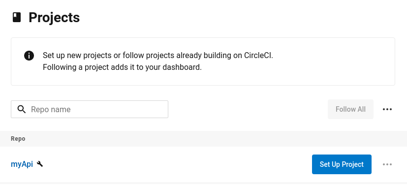

You will be required to provide a <code>.yaml</code> circleci config file if you click on 'set up project'

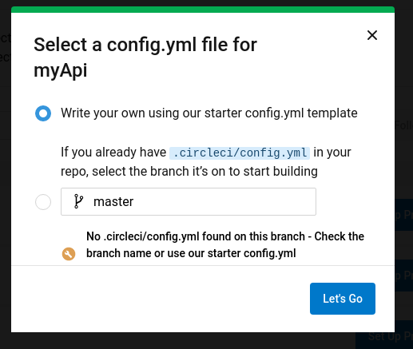

this will provide later
### 4. Creating Test With Jest
*In this section, we are going to install jest, and mongo-memory-server and use them to test our model*
We will be using Jest to perform end-to-end testing. Jest is a testing library created by Facebook and developers love it due to its simplicity and fluid intergaration with a majority of application.
**End-to-End Testing: **This is a type of testing that tests the functionality of an endpoint to ensure everything works as expected including database connection, data manupilation among others.
In our application, we are going to test the blog model since it holds the core logic of our application.
Before we begin, we need to install few packages:

```shell
#myapi
kave@kave:$ npm install --save-dev jest mongodb-memory-server @shelf/jest-mongodb
```

**jest :** A package used to test code
**mongodb-memory-server :** This package enables us to run mongodb in memory hence lightweight
**@shelf/jest-mongodb :** A jest implementation for testing mongodb functions

We first begin by creating a <code>jest.config.cjs</code> module. We are using a <code>.cjs</code> as will be using ES6 syntax to for importation purposes.
```javascript
//jest.config.cjs
module.exports = {
  preset: "@shelf/jest-mongodb",
};
```
We then create a <code>jest-mongodb-config.js</code> file to let jest know that we will be using <code>mongodb-memory-server</code>

```javascript
//jest-mongodb-config.js
module.exports = {
  mongodbMemoryServerOptions: {
    instance: {
      dbName: "jest",
    },
    binary: {
      version: "5.0.2", //Your version of MongoDB here
      skipMD5: true,
    },
    autoStart: false,
  },
};

```

Then we create a <code>globalConfig.json</code> that will be used with <code>mongodb-memory-server</code>

```json
//globalConfig.json
{"mongoUri":"mongodb://127.0.0.1:38287/"}
```
```javascript
//config.cjs
module.exports.config = () => {
  let setting = null;
  switch (process.env.NODE_ENV) {
    case "production":
      return (setting = { name: "production", PORT: 8080 });
    case "test":
      return (setting = {
        name: "test",
        PORT: 3311,
        MONGODB_URI: "mongodb://localhost:27017/test",
      });
    default:
      return (setting = {
        name: "development",
        PORT: 3000,
        MONGODB_URI: "mongodb://localhost:27017/blog",
      });
  }
};

```
Now we are ready to create our test
```shell
#myapi
kave@kave:$ mkdir src/__tests__/models
```

```shell
#myapi
kave@kave:$ touch src/__tests__/models/blog.test.js
```
In the below test, we test the models. I have included comments explaining what each part of the code does.
```javascript
//src/__test__/models/blog.test.js
const mongoose = require("mongoose");
const config = require("../../../config.cjs");
const BlogModel = require("../../models/blogModel.js");
const userPost = { title: "Test this post", content: "Test post content" };
const MONGODB_URI = "mongodb://localhost:27017/test";

describe("User Model Test", () => {
  /*
  *Before running the tests first establish
  *a database connection
  */
  beforeAll(async () => {
    await mongoose.connect(
      MONGODB_URI,
      {
        useNewUrlParser: true,
      },
      (err) => {
        if (err) {
          console.error(err);
          mongoose.disconnect();
        }
      }
    );
  });
  /*
  *After running all tests, clear the 
  *database and close the connection
  */
  afterAll(async () => {
    mongoose.connection.dropDatabase(() => {
      mongoose.connection.close();
    });
  });

  //Test whether the model accepts new posts
  test("POST create a post", async () => {
    const post = new BlogModel(userPost);
    const createdPost = await post.save();
    //should have an Id field
    expect(createdPost._id).toBeDefined();
    expect(createdPost.title).toBe(userPost.title);
    expect(createdPost.content).toBe(userPost.content);
  });

  //Test whether the model may accept fewer fields
  //than specified in the schema i.e title
  test("POST sending data with less fields - title", async () => {
    const lakingTitle = new BlogModel({ content: "Test title 2" });
    let error;
    try {
      const saveLakingTitle = await lakingTitle.save();
      err = saveLakingTitle;
    } catch (err) {
      error = err;
    }
    expect(error).toBeInstanceOf(mongoose.Error.ValidationError);
    expect(error.errors.title).toBeDefined();
  });

  //Test whether the model may accept fewer fields
  //than specified in the schema i.e content
  test("POST sending data with less fields - content", async () => {
    const lakingContent = new BlogModel({ title: "Test content 3" });
    let error;
    try {
      const saveLakingContent = await lakingContent.save();
      err = saveLakingContent;
    } catch (err) {
      error = err;
    }
    expect(error).toBeInstanceOf(mongoose.Error.ValidationError);
    expect(error.errors.content).toBeDefined();
  });

  //Test whether the model field are working correctly
  //Whether it can allow more fields than defined in the schema
  test("POST sending data with more fields", async () => {
    const addAuthor = new BlogModel({
      title: "Test title 4",
      content: "Test post content 4",
      author: "Jane Doe",
    });
    const savedAddAuthor = await addAuthor.save();
    expect(savedAddAuthor._id).toBeDefined();
    expect(savedAddAuthor.content).toBeDefined();
    expect(savedAddAuthor.title).toBeDefined();
    expect(savedAddAuthor.author).toBeUndefined();
  });
});
```
The next step is to determine how our database is setup our test database

```javascript
//src/__test__/models/db.js
const mongoose = require("mongoose");
const { MongoMemoryServer } = require("mongodb-memory-server");

const mongoServer = new MongoMemoryServer();

exports.dbConnect = async () => {
  const uri = await mongoServer.getUri();

  const mongooseOpts = {
    useNewUrlParser: true,
    useCreateIndex: true,
    useUnifiedTopology: true,
    useFindAndModify: false,
  };

  await mongoose.connect(uri, mongooseOpts);
};

exports.dbDisconnect = async () => {
  await mongoose.connection.dropDatabase();
  await mongoose.connection.close();
  await mongoServer.stop();
};

```

In the <code>package.json</code> add the following configurations, we are going to add:
<code>type</code> that will enable us deal with some ES5 and ES6 import issues
<code>test</code> that will set the node environment to test. <code>--runInBand</code> esnures that the tests run in a serial manner. <code>--detectOpenHandles</code> will enable us with additional debugging information
<code>jest</code> configration setting **coveragePathIgnorePatterns** which ignores certain directories and files that we do not wish to test in this case node_modules directory.
<code>test:cov</code> will provide coverage for our tests.

```json
  "type": "module",
  "scripts": {
    "start": "set NODE_ENV=dev && nodemon ./src/server.js",
    "test": "set NODE_ENV=test && jest --runInBand --detectOpenHandles",
    "test:cov": "jest --coverage"
  },
  "jest": {
    "coveragePathIgnorePatterns": [
      "/node_modules/"
    ]
  },
```

From terminal run
```shell
#myapi
kave@kave:$ npm test
```

You should see the following output

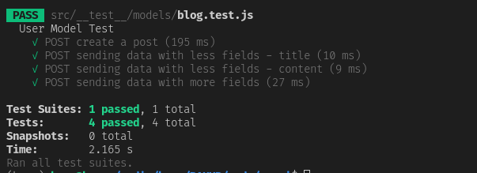

Showing all the four test are running successfully

```shell
#myapi
kave@kave:$ npm test:cov
```
You will see

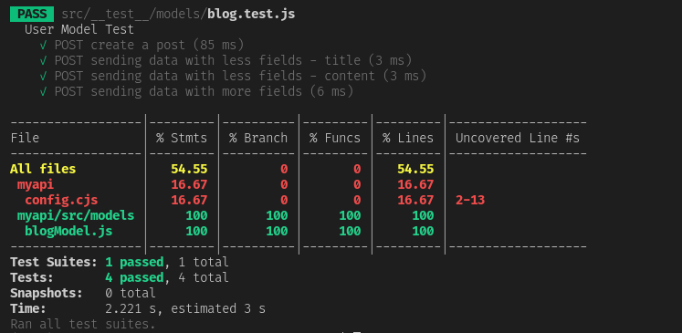

As you see the model has 100 percent test coverage

Finally, back to the Circle CI dashboard and you will see

